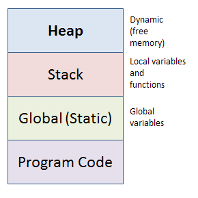
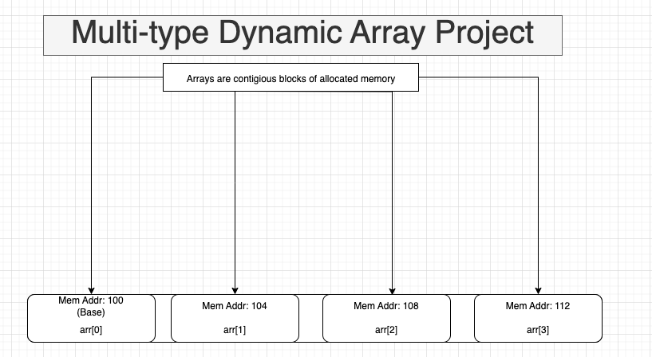

C does not have built in Vector Arrays, let alone ones that can hold multiple types, and as a project I decided to implement one. Vectors are simply dynamically allocated arrays, which means that unlike a regular array (in which it is a fixed size that cannot be extended nor shruken), It's size is not fixed, and can be extended or shrunken. This is very useful if you don't know how many elements you need to store at any given time. A Multi Type dynamically allocated array is the same thing, except for the obvious fact that you may store many different types of data inside of the array. I will give a crash course (with visuals) on both how memory works and the memory layout of an array, as well as how an array works. You may skip this part if you are familiar with memory.

### Memory is the foundation of software

Software cannot be constructed without memory, memory is deeply intertwined with hardware as it is a hardware component.
[RAM](https://en.wikipedia.org/wiki/Random-access_memory), Disk ([SSD](https://simple.wikipedia.org/wiki/Solid-state_drive), [HDD](https://en.wikipedia.org/wiki/Hard_disk_drive)) and even ROM are all memory storages. I won't go into detail about how memory is made all the way down to the material. The web browser you are using that loaded this page up (through bits and bytes of information) is working because of memory, the operating system your device is running on, which your web browser request memory from to use, is also using memory that is retrieved from the hardware components I mentioned above. But how do we visualize this abstraction so it can be useful to us? We cannot feel it, we cannot touch it, we cannot see it (unless we literally take out our RAM stick and look at it, or use a tool to show memory addresses and usage) and we cannot hear it. For programs, I will stick to 2 type of memory location. The [heap](https://en.wikipedia.org/wiki/Heap_(data_structure)) and the [stack](https://en.wikipedia.org/wiki/Stack_(abstract_data_type))

{:style="display:block; margin-left:auto; margin-right:auto"}

The stack is where local variables like function arguments and variable intializations go:

```c

int add(int c, int d) {
    return c + d;
}

int main () {
int a = 5;
double b = 6.44444;
char[5] string = "12345";
}
```

Everything above would be added to the stack, the  integers and char array we initialized, as well as the function arguments in the "add" function. The stacks purpose is to allocate data we want to use temporarily then get rid of when we are done. The stack provides a predefined structure which enables great preformance and efficent memory usage.

In the add function, we see 2 variables c and d. When this function returns c and d will be popped off of the stack and not continue to occupy space when not needed anymore.  All of the variables inside of main would cease to exist as soon as main returns. 

The heap is the complete opposite. The heap is like a playground, where you can make all sorts of structures. You are only restricted by the size of the heap (which in most cases you don't need to worry about), otherwise you can have fun! Not only that but the heap will live on until you use free it explicitly (else you have a memory leak). The heap is great for data that needs to last beyond a specific function. The heap is also great for  objects who's size we do not know at compile time, and need to allocate at run time.

```c
void *ptr = malloc(50);

free(ptr);
```

The code above allocates 50 bytes of memory on the heap and returns a pointer to the allocated memory, the type of the pointer is ```void *```, void * star means we don't  care what the type of the data is. You can cast anything to anything in C, an int to a char, void to char, int to double etc. The code then calls the ```free()``` function which releases the memory back to the operating system. After calling ```free()``` the pointer is invalid, and using it afterwards can have undefined behavior. If you aren't familiar with pointers, think of them like signs. Pointers are like signs. They simply point in the direction of the location you are trying to get too. Similarly, pointers point to the specific location in memory (address) where a value is, the actual value is held by the address.


### Constructing A Multi-Type Dynamic Array

An array is a contigious block of allocated memory:


In a fixed size integer array, when you index the array you are saying: "Bring me to the element in the array, starting from the base of the array (index 0), that is at the offset of ``index * sizeof(int)``.".

As you can see in the image, each index is offset by 4 bytes, the size of an integer on 32 and 64 bit machines. So to get to index 2, we must start from the base address, and move forward 2 x 4 bytes, which is 8 bytes. So index 2 will be located at base + 8, Which happens to be the memory location 108 in the diagram. You would then be able to interact with the value stored at that specific location in memory.

